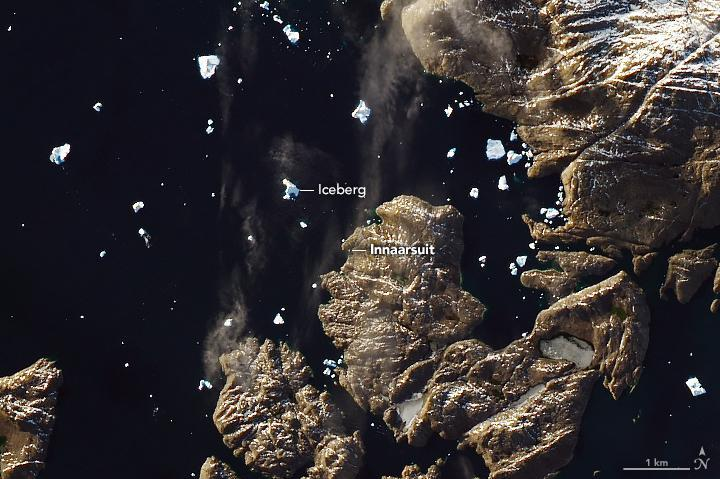
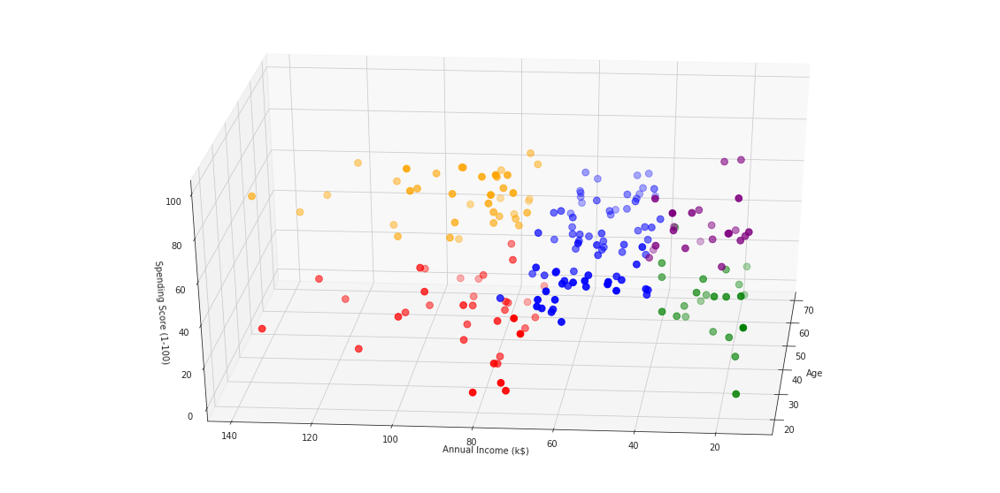

# Kaggle Solutions
Sample notebooks for Kaggle competitions.

## 1. Data Science Bowl 2018

Check out the corresponding medium blog post [Instance Segmentation of Nucleus Images](https://medium.com/@abhinav.sagar/nucleus-segmentation-using-u-net-eceb14a9ced4).

## 2. Airbus ship detection challenge

Check out the corresponding medium blog post [Deep Learning for Ship Detection and Segmentation](https://medium.com/@abhinav.sagar/deep-learning-for-ship-detection-and-segmentation-71d223aca649).

## 3. Statoil/C-CORE Iceberg Classifier Challenge

Check out the corresponding medium blog post [Deep Learning for Iceberg detection in Satellite Images](https://medium.com/@abhinav.sagar/deep-learning-for-iceberg-detection-in-satellite-images-c667acf4bad0).

## 4. Chest X-Ray Images (Pneumonia)

Check out the corresponding medium blog post [Deep Learning for Detecting Pneumonia from X-ray Images](https://medium.com/@abhinav.sagar/deep-learning-for-detecting-pneumonia-from-x-ray-images-fc9a3d9fdba8).

## 5. Mall Customer Segmentation Data

Check out the corresponding medium blog post [Customer Segmentation Using K Means Clustering](https://medium.com/@abhinav.sagar/customer-segmentation-using-k-means-clustering-d33964f238c3).

## 6. Planet: Understanding the Amazon from Space








## Citing

```
@misc{Abhinav:2019,
  Author = {Abhinav Sagar},
  Title = {Kaggle Tutorial},
  Year = {2019},
  Publisher = {GitHub},
  Journal = {GitHub repository},
  Howpublished = {\url{https://github.com/abhinavsagar/Kaggle-Tutorial.git}}
}
```
